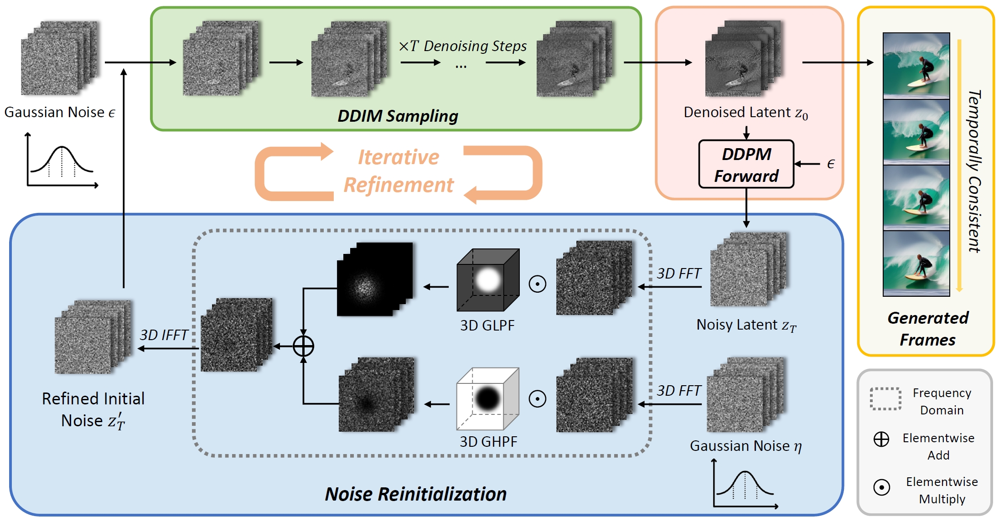

# FreeInit : Bridging Initialization Gap in Video Diffusion Models

[](https://arxiv.org/abs/2312.07537)
[](https://tianxingwu.github.io/pages/FreeInit/)
[](https://youtu.be/lS5IYbAqriI)
[](https://huggingface.co/spaces/TianxingWu/FreeInit)
[](https://hits.seeyoufarm.com)


<div>
    <h4 align="center">
        
    </h4>
</div>

This repository contains the implementation of the following paper:
> **FreeInit: Bridging Initialization Gap in Video Diffusion Models**<br>
> [Tianxing Wu](https://tianxingwu.github.io/), [Chenyang Si](https://chenyangsi.github.io/), [Yuming Jiang](https://yumingj.github.io/), [Ziqi Huang](https://ziqihuangg.github.io/), [Ziwei Liu](https://liuziwei7.github.io/)<br>

From [MMLab@NTU](https://www.mmlab-ntu.com/) affiliated with S-Lab, Nanyang Technological University


## :open_book: Overview


We propose **FreeInit**, a concise yet effective method to improve temporal consistency of videos generated by diffusion models. FreeInit requires no additional training and introduces no learnable parameters, and can be easily incorporated into arbitrary video diffusion models at inference time.


## :fire: Updates
- [01/2024] FreeInit has been integrated into [Diffusers](https://github.com/huggingface/diffusers) and [ComfyUI-AnimateDiff-Evolved](https://github.com/Kosinkadink/ComfyUI-AnimateDiff-Evolved). Big thanks to [@a-r-r-o-w](https://github.com/a-r-r-o-w), [@DN6](https://github.com/DN6) and [@Kosinkadink](https://github.com/Kosinkadink)!
- [12/2023] We released a demo on [Hugging Face🤗](https://huggingface.co/spaces)! Feel free to try it out: [[demo link]](https://huggingface.co/spaces/TianxingWu/FreeInit).
- [12/2023] [Arxiv paper](https://arxiv.org/abs/2312.07537) available.
- [12/2023] Code released.
- [12/2023] [Project page](https://tianxingwu.github.io/pages/FreeInit/) and [video](https://youtu.be/lS5IYbAqriI) available.

## :page_with_curl: Usage
In this repository, we use [AnimateDiff](https://animatediff.github.io/) as an example to demonstrate how to integrate FreeInit into current text-to-video inference pipelines.

In [pipeline_animation.py](examples/AnimateDiff/animatediff/pipelines/pipeline_animation.py), we define a class `AnimationFreeInitPipeline` inherited from `AnimationPipeline`, showing how to modify the original pipeline.

In [freeinit_utils.py](examples/AnimateDiff/animatediff/utils/freeinit_utils.py), we provide frequency filtering code for Noise Reinitialization.

An example inference script is provided at [animate_with_freeinit.py](examples/AnimateDiff/scripts/animate_with_freeinit.py).

Please refer to the above scripts as a reference when integrating FreeInit into other video diffusion models.


## :hammer: Quick Start

### 1. Clone Repo

```
git clone https://github.com/TianxingWu/FreeInit.git
cd FreeInit
cd examples/AnimateDiff
```

### 2. Prepare Environment

```
conda env create -f environment.yaml
conda activate animatediff
```

### 3. Download Checkpoints

Please refer to the [official repo](https://github.com/guoyww/AnimateDiff) of AnimateDiff. The setup guide is listed [here](https://github.com/guoyww/AnimateDiff/blob/main/__assets__/docs/animatediff.md).


### 4. Inference with FreeInit
After downloading the base model, motion module and personalize T2I checkpoints, run the following command to generate animations with FreeInit. The generation results is then saved to `outputs` folder.
```
python -m scripts.animate_with_freeinit \
    --config "configs/prompts/freeinit_examples/RealisticVision_v2.yaml" \
    --num_iters 5 \
    --save_intermediate \
    --use_fp16
```
where `num_iters` is the number of freeinit iterations. We recommend to use 3-5 iterations for a balance between the quality and efficiency. For faster inference, the argument `use_fast_sampling` can be enabled to use the *Coarse-to-Fine Sampling* strategy, which may lead to inferior results.

You can change the text prompts in the config file. To tune the frequency filter parameters for better results, please change the `filter_params` settings in the config file. The `'butterworth'` filter with `n=4, d_s=d_t=0.25` is set as default. For base models with larger temporal inconsistencies, please consider using the `'guassian'` filter.


More `.yaml` files with different motion module / personalize T2I settings are also provided for testing.

### 🤗 Gradio Demo

We also provide a Gradio Demo to demonstrate our method with UI. Running the following command will launch the demo. Feel free to play around with the parameters to improve generation quality.

```
python app.py
```
Alternatively, you can try the online demo hosted on Hugging Face: [[demo link]](https://huggingface.co/spaces/TianxingWu/FreeInit) .

## :framed_picture: Generation Results

Please refer to our [project page](https://tianxingwu.github.io/pages/FreeInit/) for more visual comparisons.

## :four_leaf_clover: Community Contributions

- Integration to ComfyUI Extention: [ComfyUI-AnimateDiff-Evolved](https://github.com/Kosinkadink/ComfyUI-AnimateDiff-Evolved) (by [@Kosinkadink](https://github.com/Kosinkadink))
- Integration to HuggingFace Diffusers: [Diffusers](https://github.com/huggingface/diffusers) (by [@a-r-r-o-w](https://github.com/a-r-r-o-w) and [@DN6](https://github.com/DN6))
- Google Colab: [FreeInit-colab](https://github.com/camenduru/FreeInit-colab) (by [@camenduru](https://github.com/camenduru))

## :fountain_pen: Citation

   If you find our repo useful for your research, please consider citing our paper:

   ```bibtex
   @article{wu2023freeinit,
        title={FreeInit: Bridging Initialization Gap in Video Diffusion Models},
        author={Wu, Tianxing and Si, Chenyang and Jiang, Yuming and Huang, Ziqi and Liu, Ziwei},
        journal={arXiv preprint arXiv:2312.07537},
        year={2023}
   ```


## :white_heart: Acknowledgement

This project is distributed under the MIT License. See `LICENSE` for more information.

The example code is built upon [AnimateDiff](https://github.com/guoyww/AnimateDiff). Thanks to the team for their impressive work!
